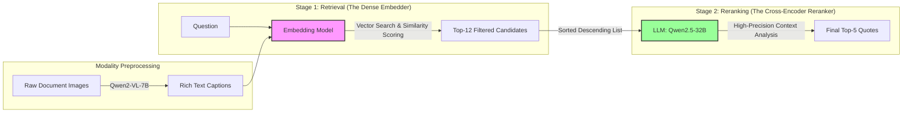
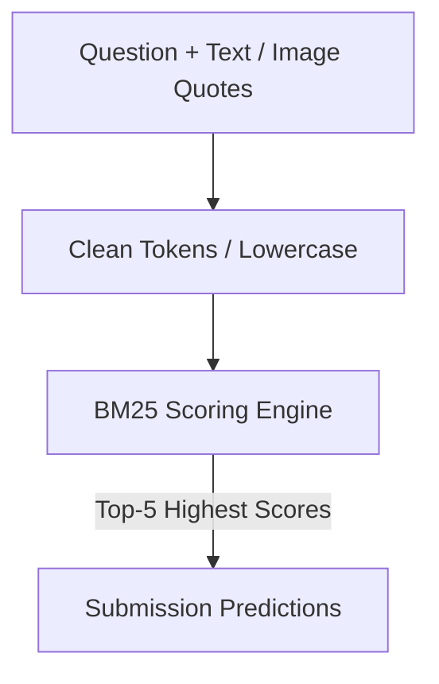
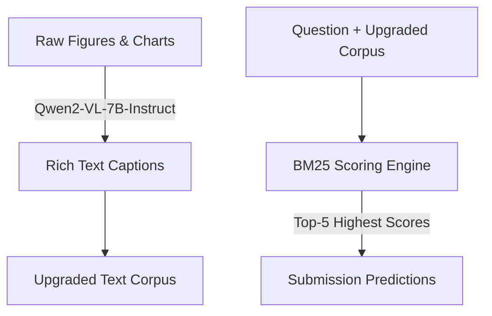
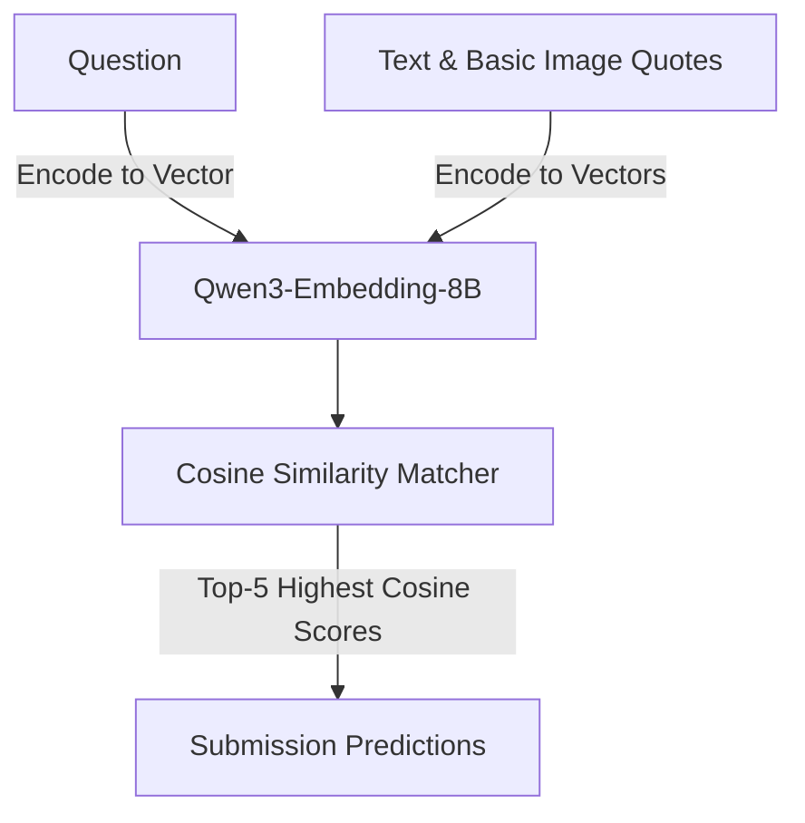
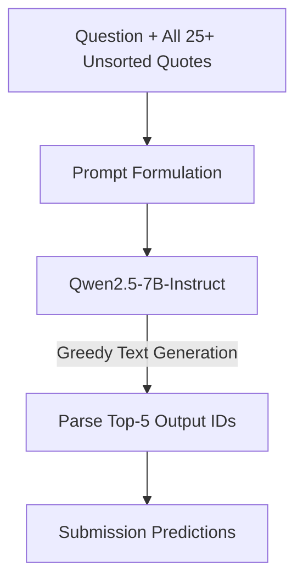
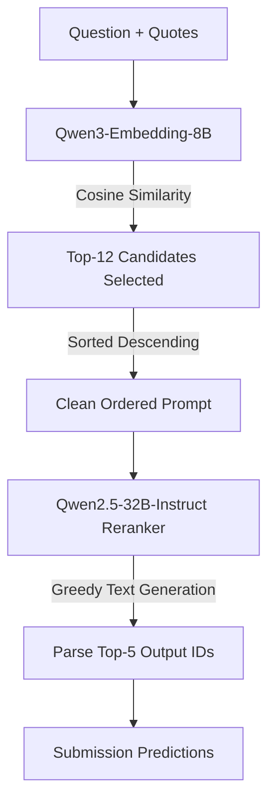
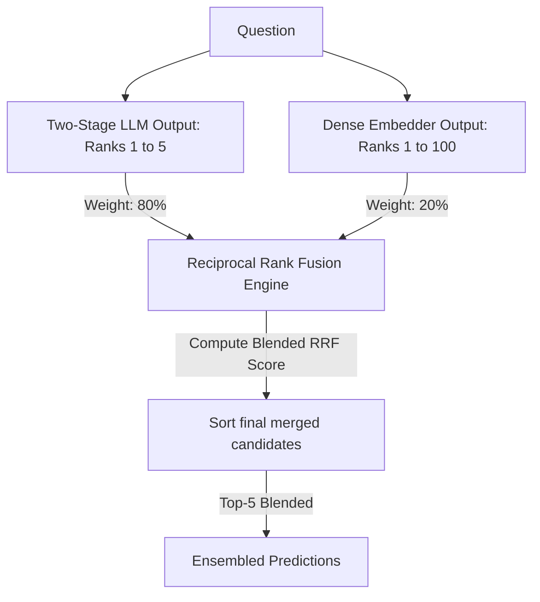
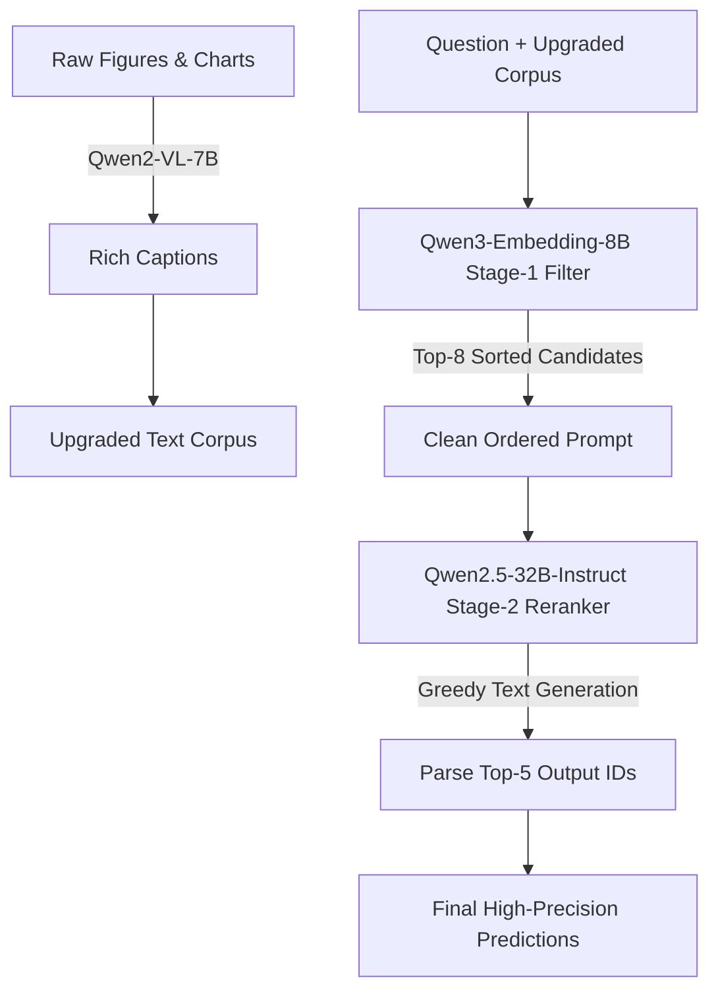
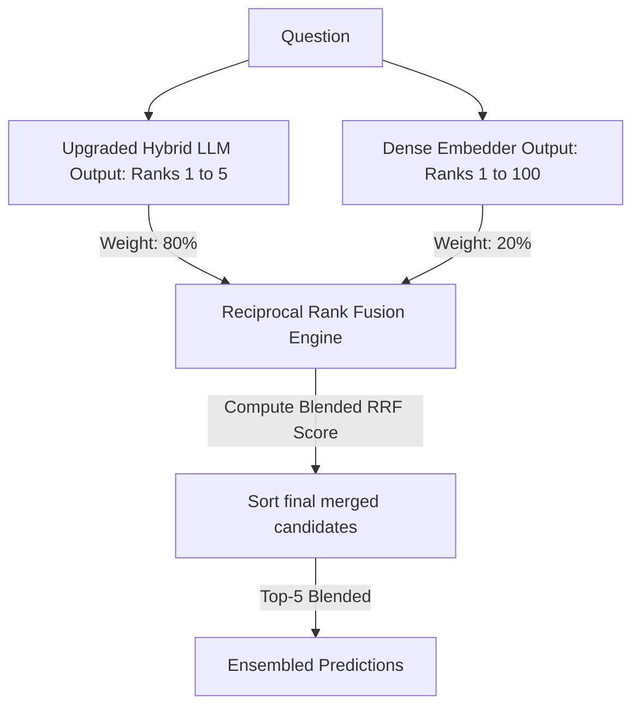

# Multimodal RAG Retrieval Experiments Summary & Architectural Flowcharts

This report compiles and analyzes the performance of various retrieval strategies implemented for the Multimodal RAG pipeline. The objective is to retrieve the top 5 most relevant quotes (text or images) for a given query, maximizing **Recall@5**.

---

## 🧭 Architectural Overview: Where the Dense Embedder Fits In

In a modern, production-grade retrieval-augmented generation (RAG) system, the **Dense Embedder** (here, `Qwen3-Embedding-8B`) serves as the core of **Stage 1 (Retrieval)**.

*   **Stage 1 - Retrieval (High Recall, Low Latency)**: We have over 25 candidate quotes per question. Running a massive 32B LLM directly on all of them is too slow and OOM-prone. The **Dense Embedder** encodes the question and all candidate snippets into high-dimensional vectors, performs quick similarity search, and filters out the noise—narrowing the pool down to the **Top-12 candidates**.
*   **Stage 2 - Reranking (High Precision, High Latency)**: The **LLM Reranker** takes the Top-12 sorted candidates and performs deep, instruction-guided cross-encoder reasoning to select the final **Top-5 predictions**.

---

## 📊 Performance Leaderboard

| Experiment Name | Internal Val Recall@5 | Kaggle LB Recall@5 | Architecture | Key Design Choices & Notes |
| :--- | :---: | :---: | :---: | :--- |
| 🥇 **`submission_qwen3-8b_qwen2.5-32b-instruct_ordered`** | **0.8425** | **0.79506** | Two-Stage (Dense + LLM) | Sorts prompt context by Dense score, filters to Top-12 candidates, and reranks using Qwen2.5-32B-Instruct. |
| 🥈 **`submission_qwen3-8b_qwen2.5-32b-instruct_ordered_rrf`** | **0.8425** | **0.79506** | Two-Stage + RRF | Combined LLM reranker scores (80%) and Dense retriever scores (20%) using Reciprocal Rank Fusion (RRF). |
| 🥉 **`submission_llm-qwen2.5-32b-vanilla`** | 0.8311 | 0.78890 | Pure Reranker (Stage 2) | Directly passes unsorted candidates to Qwen2.5-32B-Instruct. Slower, lacks pre-filtering, and prone to context noise. |
| 4️⃣ **`submission_llm-qwen2.5-32b-hybrid`** *(New)* | 0.7709 | 0.70338 | Upgraded Two-Stage | Replaces basic image descriptions with rich **Qwen2-VL-7B** captions. Filters to Top-8 candidates (with 700-char truncation and SDPA) to fit safely in VRAM memory constraints. |
| 5️⃣ **`submission_dense-qwen3-emb-8b-vanilla`** | 0.7169 | 0.66332 | Pure Retriever (Stage 1) | Pure vector semantic search using `Qwen/Qwen3-Embedding-8B` over original image descriptions and text quotes. |
| 6️⃣ **`submission_llm-qwen2.5-7b-vanilla`** | 0.7101 | 0.64791 | Pure Reranker (Stage 2) | Direct generation using a smaller 7B LLM (Qwen2.5-7B-Instruct). |
| 7️⃣ **`submission_vlm-rich-caption_bm25`** | 0.6717 | *Pending* | Two-Stage (VLM + BM25) | Upgraded Stage-1 image preprocessing: replaced sparse default image descriptions with dense **Qwen2-VL-7B** captions, then ran BM25 keyword matching. |
| 8️⃣ **`submission_bm25-baseline`** | 0.6604 | 0.64946 | Pure Retriever (Stage 1) | Vanilla BM25 keyword matching over original candidate texts and basic image descriptions. |

---

## 🎨 Experiment Architectural Flowcharts

Here is the exact pipeline flowchart for each experiment performed in this workspace:

### 1. Pure Retriever: Vanilla BM25 (`submission_bm25-baseline`)
Keyword-matching search over the original text candidates and the sparse, pre-provided image descriptions.

### 2. Upgraded Keyword: VLM BM25 (`submission_vlm-rich-caption_bm25`)
Keyword-matching search using high-detail visual captions transcribed from raw figures and charts by the Qwen2-VL model.

### 3. Pure Retriever: Dense Vector Search (`submission_dense-qwen3-emb-8b-vanilla`)
Semantic vector matching using Qwen3-Embedding-8B without any generative LLM steps.

### 4. Pure Reranker: 7B LLM Vanilla (`submission_llm-qwen2.5-7b-vanilla`)
Generative predictions using the smaller Qwen2.5-7B-Instruct model directly on raw, unsorted candidates.

### 5. Pure Reranker: 32B LLM Vanilla (`submission_llm-qwen2.5-32b-vanilla`)
Direct generative prediction by passing all 25+ raw, unsorted candidate quotes inside a single large prompt to the 32B LLM.

### 6. Two-Stage Reranker: Dense + LLM (`submission_qwen3-8b_qwen2.5-32b-instruct_ordered`)
A state-of-the-art hybrid setup where Stage 1 (Qwen3-8B) filters out noise and sorts candidates in descending order, making it incredibly easy for Stage 2 (Qwen2.5-32B) to select the perfect evidence.

### 7. Two-Stage + Reciprocal Rank Fusion Ensemble (`..._ordered_rrf`)
Combines the generative selections of the 32B LLM (weighted 80%) and the raw cosine scores of the 8B Embedder (weighted 20%) to produce highly robust merged ranks.

### 8. Upgraded Two-Stage: VLM + Dense + LLM (`submission_llm-qwen2.5-32b-hybrid`)
Pre-processes all images with Qwen2-VL-7B to obtain rich visual captions, filters candidates down to the Top-8 using the 4-bit Dense Embedder, and reranks them with Qwen2.5-32B-Instruct using SDPA attention.

### 9. Upgraded Two-Stage + Reciprocal Rank Fusion Ensemble (`submission_ensemble-hybrid`)
Our final ensembled pipeline. Combines the high-precision predictions of our Upgraded Two-Stage model (weighted 80%) and the raw similarity scores of the Dense Embedder (weighted 20%) using Reciprocal Rank Fusion (RRF) to output highly generalizable predictions.
