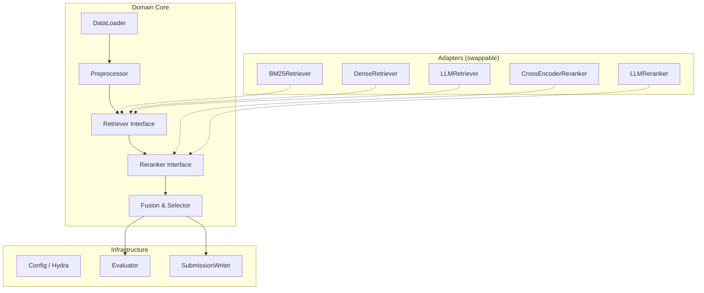

# HW3 — Multimodal RAG Retriever: Implementation Plan

## 1. Problem Summary

| Dimension | Detail |
|---|---|
| **Task** | Retrieve top-5 evidence items (text + image quotes) from a multimodal document to support answering a question |
| **Metric** | Recall@5 |
| **Train / Test** | 2 055 / 1 798 samples |
| **Candidate pool** | Variable-length lists of `text_quotes` and `img_quotes` per sample (IDs like `text1`, `image3`) |
| **Constraint** | Open-weight models only, ≤ 80 B total params (MoE counted by total, not active) |
| **Hardware** | 1 × NVIDIA RTX 4090, 24 GB VRAM |
| **Deliverables** | Kaggle submission CSV + Report (Q1–Q4) |

> [!IMPORTANT]
> This is a **retrieval-only** task — no answer generation is required. The gold standard is overlap between predicted and ground-truth `quote_id` sets.

---

## 2. Architecture: Modular Clean Architecture

The pipeline follows **Clean Architecture** principles: domain logic is independent of frameworks, and I/O adapters are swappable. This enables the comparative experiments required by the report (BM25 vs Dense vs LLM vs hybrid).



### Pipeline Stages

| Stage | Purpose |
|---|---|
| **1. Preprocessing** | Parse JSONL, normalize text, build per-sample candidate pools, optionally generate/improve image descriptions with a VLM |
| **2. Candidate Retrieval** | First-stage recall using BM25 and/or dense embeddings; retrieve top-K (K ≫ 5) candidates per query |
| **3. Reranking** | Second-stage precision using a cross-encoder or LLM-based pointwise/listwise scorer to re-order the top-K candidates |
| **4. Fusion & Selection** | Merge scores across retrieval methods (RRF / weighted), select final top-5 per sample |

---

## 3. Proposed Folder Structure

```
hw3/
├── data/                          # Raw data (existing)
│   ├── train.jsonl
│   ├── test.jsonl
│   ├── images/images/             # 14 826 image files
│   └── sample_submission.csv
│
├── src/                           # Source Core (Clean "Production" Logic)
│   ├── __init__.py
│   ├── data/
│   │   ├── loader.py              # JSONL parsing, schema validation
│   │   └── preprocessor.py        # Text cleaning, image desc helper
│   ├── retrievers/
│   │   ├── base.py                # Abstract Retriever interface
│   │   ├── bm25.py                # BM25 retriever
│   │   ├── dense.py               # Dense bi-encoder retriever
│   │   └── llm.py                 # LLM-based selector
│   ├── rerankers/
│   │   ├── base.py                # Abstract Reranker interface
│   │   ├── cross_encoder.py       # Cross-encoder reranker
│   │   └── llm_reranker.py        # LLM listwise reranker
│   ├── fusion/
│   │   └── fusion.py              # RRF fusion
│   └── evaluation/
│       └── metrics.py             # Local Recall@K evaluator
│
├── notebooks/                     # Central Interactive Workspace (Primary Drivers)
│   ├── eda.ipynb                  # Data exploration & analysis (Phase 1 Complete)
│   ├── experiments.ipynb          # "Run Models" Hub - Swap configurations & run local validation
│   ├── generate_submission.ipynb  # Kaggle Prediction & submission export engine
│   └── figures.ipynb              # Visualization for Q2–Q4 reports
│
├── outputs/                       # Experiment outputs (gitignored)
│   ├── submissions/
│   └── logs/
│
└── hw3_context.md
```

---

## 4. Data Schema

```python
@dataclass
class TextQuote:
    quote_id: str          # e.g., "text1"
    type: str              # "text"
    text: str              # raw content
    page_id: int
    layout_id: int

@dataclass
class ImageQuote:
    quote_id: str          # e.g., "image5"
    type: str              # "image"
    img_path: str          # relative path under images/
    img_description: str   # pre-generated caption
    page_id: int
    layout_id: int

@dataclass
class Sample:
    q_id: int
    doc_name: str
    domain: str
    question: str
    evidence_modality_type: list[str]   # e.g., ["table", "text"]
    question_type: str
    text_quotes: list[TextQuote]
    img_quotes: list[ImageQuote]
    gold_quotes: list[str] | None       # None for test samples

@dataclass
class Prediction:
    q_id: int
    ranked_quote_ids: list[str]         # len ≤ 5, ordered by relevance
```

---

## 5. Key Modules & API

### 5.1 Retriever Interface

```python
class BaseRetriever(ABC):
    @abstractmethod
    def retrieve(self, sample: Sample, top_k: int = 20) -> list[tuple[str, float]]:
        """Return [(quote_id, score), ...] sorted by descending relevance."""
```

| Retriever | Strategy | Model / Lib | Notes |
|---|---|---|---|
| **BM25Retriever** | Lexical match on `question` vs `text` + `img_description` | `rank_bm25` | Report baseline |
| **DenseRetriever** | Bi-encoder embeddings → cosine similarity | `sentence-transformers` (e.g., `bge-large-en-v1.5`, `gte-Qwen2-7B-instruct`) | Report baseline; encode all candidates per sample |
| **LLMRetriever** | Prompt an LLM to directly select top-5 from candidate list | vLLM / HF with `Qwen3-8B` or `Gemma-3-27B` | Report baseline; needs careful prompt design |

### 5.2 Reranker Interface

```python
class BaseReranker(ABC):
    @abstractmethod
    def rerank(self, question: str, candidates: list[tuple[str, str]], top_k: int = 5) -> list[tuple[str, float]]:
        """candidates = [(quote_id, text_or_description), ...]. Return reranked [(quote_id, score), ...]."""
```

| Reranker | Strategy | Model |
|---|---|---|
| **CrossEncoderReranker** | Cross-encoder scoring (query, passage) pairs | `bge-reranker-v2-m3` or `jina-reranker-v2-base-multilingual` |
| **LLMReranker** | Listwise prompt: "rank these passages by relevance" | `Qwen3-8B` / `Gemma-3-27B` |

### 5.3 Fusion

```python
def reciprocal_rank_fusion(ranked_lists: list[list[tuple[str, float]]], k: int = 60) -> list[tuple[str, float]]:
    """Combine multiple ranked lists via RRF."""
```

### 5.4 Evaluator

```python
def recall_at_k(predictions: list[Prediction], gold: dict[int, list[str]], k: int = 5) -> float:
    """Compute mean Recall@K across samples."""
```

---

## 6. Recommended Strategy (Competitive Submission)

The final competitive pipeline should follow a **retrieve-then-rerank** architecture:

```
┌──────────────────────────────────────────────────────┐
│ Per-sample Pipeline                                  │
│                                                      │
│  Question ──┬──► BM25 (top-20) ──┐                   │
│             │                    ├──► RRF (top-15)    │
│             └──► Dense (top-20) ─┘        │           │
│                                           ▼           │
│                                  Cross-Encoder        │
│                                  Reranker (top-5)     │
│                                           │           │
│                                    ┌──────┘           │
│                                    ▼                  │
│                              Final top-5              │
└──────────────────────────────────────────────────────┘
```

> [!TIP]
> **Why this hybrid?** BM25 catches exact keyword matches (table headers, specific numbers), while dense retrieval captures semantic similarity. RRF fusion followed by cross-encoder reranking consistently outperforms either approach alone in retrieval benchmarks.

### Model Choices for 24 GB VRAM

| Role | Recommended Model | Size | VRAM Est. |
|---|---|---|---|
| Dense Embedder (active) | `Qwen/Qwen3-Embedding-8B` | 8 B | ~16 GB (fp16) |
| Cross-Encoder Reranker | `BAAI/bge-reranker-v2-m3` | 568 M | ~2.5 GB |
| LLM (direct select / rerank) | `Qwen/Qwen3-8B` (4-bit GPTQ) | 8 B | ~6 GB |
| Dense Embedder (deferred) | `BAAI/bge-large-en-v1.5` | 335 M | ~1.5 GB |

> [!WARNING]
> Running a 7B embedding model + a separate reranker simultaneously will exceed 24 GB. Serialize the stages or use a smaller embedder.

---

## 7. Experiment Matrix (for Report Q2–Q4)

### Q2: Comparison of Retrieval Methods

| Experiment | Retriever | Reranker | Purpose |
|---|---|---|---|
| `exp-bm25` | BM25 only | None | Lexical baseline |
| `exp-dense` | Dense (Qwen3-8B) | None | Semantic baseline (Active) |
| `exp-llm` | LLM direct selection | None | LLM baseline |
| `exp-hybrid` | BM25 + Dense + RRF | Cross-Encoder | Full pipeline |

### Q3: Multimodal Embedding vs Text Description

| Experiment | Image Handling | Model |
|---|---|---|
| `exp-img-text` | Use `img_description` as text → embed with text model | bge-large |
| `exp-img-multimodal` | Embed raw image with multimodal model | `nomic-embed-vision-v1.5` or `jina-clip-v2` |

### Q4: Modality Preference Analysis

- Compute modality-specific Recall@5 (text-only vs image-only gold quotes)
- Measure the proportion of text vs image candidates in top-5 across methods
- Analyze by `evidence_modality_type` field

---

## 8. Technical Gotchas & Risks

### 8.1 Data-Level

| Issue | Detail | Mitigation |
|---|---|---|
| **Variable candidate pool sizes** | Each sample has a different number of text/image candidates. Some may have 50+ candidates, others just a few. | Batch processing must handle variable-length inputs; BM25 index is per-sample |
| **Gold quotes can be image-only** | From the data sample: `gold_quotes: ["image2"]`, `["image3"]`. Text-only retrievers will miss these. | Must include `img_description` in the candidate pool to cover image evidence |
| **img_description quality** | Pre-generated captions may be noisy, especially for complex tables/charts | Consider regenerating with a better VLM if time allows |
| **Quote IDs are per-sample** | `text1` in sample 0 ≠ `text1` in sample 1. No global corpus — retrieval is per-sample. | Do NOT build a global index. Each sample's candidates form a self-contained pool. |

### 8.2 Model-Level

| Issue | Detail | Mitigation |
|---|---|---|
| **24 GB VRAM limit** | Larger models (27B+) need aggressive quantization. Two models loaded simultaneously may OOM. | Serialize pipeline stages; use 4-bit quant; clear GPU cache between stages |
| **BM25 on short text** | Image descriptions and some text quotes are short → BM25 may under-perform | Combine with dense retrieval |
| **LLM context window** | Concatenating all candidates + question into a single prompt may exceed context window for samples with many candidates | Truncate or use sliding-window; pre-filter with BM25/dense first |
| **LLM output parsing** | LLM may return quote IDs in unexpected formats | Robust regex parsing + fallback strategies |

### 8.3 Evaluation-Level

| Issue | Detail | Mitigation |
|---|---|---|
| **Validation Strategy** | Zero-shot models don't require training, but pipeline combinations need evaluation. | Treat entire `train.jsonl` as the "Validation Set". Calculate local Recall@5 on it to tune retrieval hyperparameters. |
| **Public vs Private split** | Only 30% of test is public. Public LB may not reflect final ranking. | Rely heavily on the local validation Recall@5; do not overfit to Public Leaderboard. |
| **5 submissions/day cap** | Limited experimentation on test set | Iterate and confirm gains locally first before submitting via `generate_submission.ipynb`. |
| **Recall@5 metric** | Extra predictions beyond 5 are ignored; fewer than 5 hurts recall | Ensure the selector logic outputs exactly 5 quote IDs for every single question. |

### 8.4 Environment-Level

| Issue | Detail | Mitigation |
|---|---|---|
| **Bare Python environment** | No PyTorch, transformers, etc. installed yet | Need a `requirements.txt` and initial setup step |
| **Slow I/O observed** | Python scripts are slow to start on this server | Use efficient data loading; cache processed data to disk |

---

## 9. Execution Roadmap

| Phase | Tasks | Priority |
|---|---|---|
| **Phase 0: Setup** | Install deps (`torch`, `transformers`, `sentence-transformers`, `rank_bm25`, `vllm`), verify GPU | 🔴 Critical |
| **Phase 1: Data & EDA** | Load data, compute stats, verify schema, explore modality distribution | 🔴 Critical |
| **Phase 2: BM25 Baseline** | Implement BM25Retriever, eval on train, submit to Kaggle | 🔴 Critical |
| **Phase 3: Dense Baseline** | Implement DenseRetriever with Qwen3-8B, eval, submit (Completed) | 🟢 Complete |
| **Phase 4: Hybrid + Rerank** | BM25+Dense → RRF → Cross-Encoder reranker | 🟡 High |
| **Phase 5: LLM Retriever** | Implement LLM direct selection for report comparison | 🟢 Medium |
| **Phase 6: Multimodal Exp** | Compare text-desc vs multimodal embedding for images (Q3) | 🟢 Medium |
| **Phase 7: Analysis** | Modality preference analysis (Q4), generate figures | 🟢 Medium |
| **Phase 8: Report** | Write Q1–Q4 report | 🟡 High |

---

## 10. Dependencies

```
# requirements.txt
torch>=2.2.0
transformers>=4.40.0
sentence-transformers>=3.0.0
rank_bm25>=0.2.2
faiss-cpu>=1.7.4        # or faiss-gpu
vllm>=0.5.0             # for LLM inference
accelerate>=0.30.0
pydantic>=2.0
pandas
numpy
tqdm
PyYAML
matplotlib
seaborn
```

---

> [!NOTE]
> **Awaiting your approval** before generating any code. Key decisions for you:
> 1. Do you want to start with Phase 0 (environment setup) + Phase 2 (BM25 baseline) first?
> 2. Any preference on the LLM model to use (Qwen3-8B vs Gemma-3-27B)?
> 3. Do you already have a conda/venv environment set up, or should I create one?
